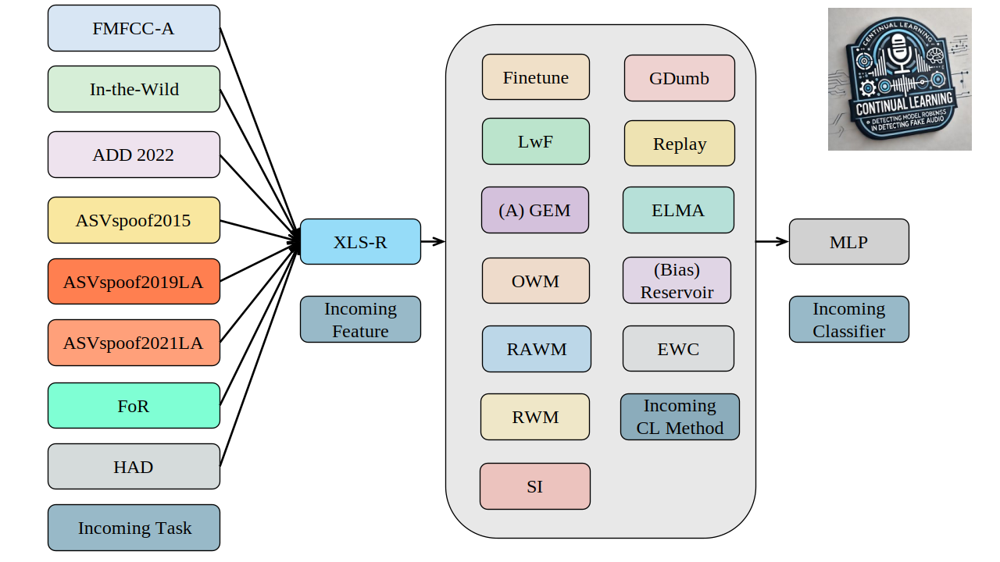

# Towards Robust Audio Deepfake Detection: An Evolving Benchmark for Continual Learning

This repository hosts the official project of the paper ["Towards Robust Audio Deepfake Detection: An Evolving Benchmark for Continual Learning"](https://arxiv.org/abs/2405.08596)!

## Introduction

With the roll-out of advanced models like GPT-4, GPT-4o, and Claude, as well as the rapid development of speech generation technology, the line between real and synthetic voices is getting blurrier, making it tough for us to tell them apart just by listening. This trend raises a pressing question: how can we identify these constantly evolving generated speech? To tackle this challenge, we introduce a new benchmark. This benchmark utilizes various continual learning methods to effectively detect generated and falsified audio, making it easier for the research community to dive deeper into this field.

Test your deepfake audio detection model’s continual learning ability using our benchmark, which supports various state-of-the-art methods.🥳



| **Method (EER%)** | **T1** | **T2** | **T3** | **T4** | **T5** | **T6** | **T7** | **T8** |
|:-----------------:|:------:|:------:|:------:|:------:|:------:|:------:|:------:|:------:|
| Replay            | 7.6    | 3.6    | 8.0    | 9.6    | 3.6    | 29.6   | **16.0**   | 14.8   |
| EWC               | 12.0   | 18.4   | 26.0   | 26.8   | 4.4    | 38.4   | 27.2   | 22.4   |
| OWM               | 28.4   | 41.2   | 44.0   | 30.0   | 43.6   | 46.4   | 43.2   | 48.0   |
| GEM               | 17.2   | 17.2   | 25.6   | 19.6   | 20.8   | 44.4   | 33.2   | 21.6   |
| LwF               | 12.4   | 11.6   | 22.8   | 29.6   | 7.2    | 37.2   | 27.2   | 22.0   |
| RAWM              | 19.2   | 19.6   | 23.6   | 31.6   | 11.6   | 38.4   | 29.6   | 26.4   |
| RWM               | 8.0    | 24.8   | 29.6   | 27.6   | 11.6   | 36.0   | 22.8   | 20.0   |
| SI                | 13.2   | 12.0   | 19.2   | 30.4   | 5.2    | 40.0   | 26.4   | 22.4   |
| ***ELMA (Ours)*** | **5.6**    | **2.8**    | **3.2**    | **6.0**    | **2.0**    | **20.8**   | **16.0**   | **13.6**   |

##### The checkpoints of ELMA can be found on ["here"](https://zenodo.org/records/13762800)!

##### Features file will be uploaded and then you can download it!
## 🚀 Quick Start

### Step 1: Set up the environment
```bash
conda create -n cl_fad --python=3.8
pip install -r requirement.txt
```
### Step 2: Configure your experiment Create a configuration file `config.yaml` or use the provided template located at `yaml/fad_feature.yaml`.

### Step 3: Train your model Run the following command to start training: 
```bash
bash train.sh
```
## 🗓️ Change Log

### 2024.05.08 
* 🎯 Added the **Equal Error Rate (EER)** metric to the benchmark. 
* 🚀 To start training, simply run: 
```bash 
bash train.sh
```
### 2024.07.21 
* ✅ Most methods can run normally. 
* 🔍 Currently debugging the **ELMA**
### 2024.08.13
* ✨ Major modifications to the original benchmark: It is now clearer and faster.
* 🔧 Currently running 8 experiments.
* 🔍 Continued debugging of ELMA.
### 2024.09.14
* 🎉 Successfully completed debugging of ELMA, which now shows great results!

## Citation

If you find this toolkit useful, please consider citing following papers.

```
@misc{elma,
  title={Towards Robust Audio Deepfake Detection: A Evolving Benchmark for Continual Learning},
  author={Xiaohui Zhang, Jiangyan Yi, and Jianhua Tao},
  year={2024},
  eprint={2405.08596},
  archivePrefix={arXiv},
  primaryClass={cs.SD},
  url={https://arxiv.org/abs/2405.08596},
}
```
